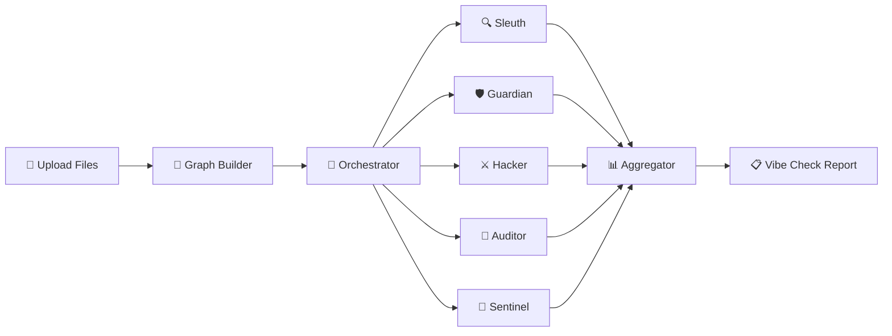
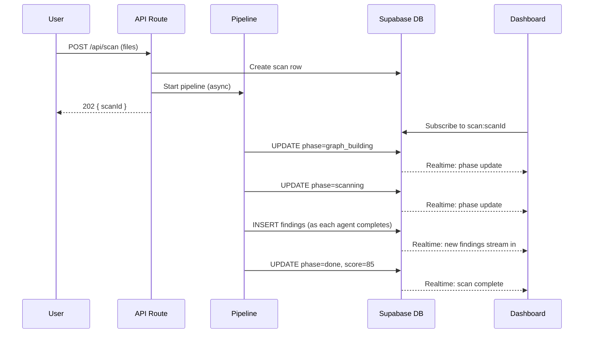

# 🛡️ CodeSafe — Multi-Agent Security Intelligence Platform

## Architecture & Feature Report

> **Version**: v2.0 (April 2026)  
> **Stack**: Next.js + TypeScript + Google Gemini AI + Supabase Realtime  
> **Differentiator**: The only scanner that detects AI-generated code anti-patterns

---

## 📐 System Architecture Overview

CodeSafe uses a **multi-agent pipeline architecture** where specialized AI agents scan code in parallel, each an expert in a specific vulnerability domain. This approach outperforms single-model scanners because:

1. **Domain Focus** — Each agent scans ONLY for its specialty (no attention bleed)
2. **Parallel Execution** — All agents fire simultaneously (faster scans)
3. **Cross-Validation** — The Aggregator cross-references findings to eliminate false positives
4. **Graph-Aware** — Every agent receives dependency context, enabling cross-file vulnerability detection



---

## 🔄 Pipeline Lifecycle — 4 Phases

### Phase 1: Knowledge Graph (0% → 10%)
**Module**: [graph-builder/index.ts](file:///d:/SAAS/vidtoui/app/codesafe/lib/graph-builder/index.ts)

> Pure static analysis — **zero LLM calls**. Fast, free, deterministic.

The Graph Builder parses all uploaded files and creates a **Knowledge Graph** — a dependency map that shows how files connect to each other. This enables cross-file vulnerability detection.

**What it does:**
- Parses imports/exports across all supported languages (TS, JS, Python, Go, Java, PHP, Ruby, C#, Swift, Kotlin, **Dart/Flutter**)
- Resolves import paths (relative, package, fuzzy matching)
- Classifies files by risk type: `entry`, `auth`, `db`, `middleware`, `crypto`, `config`, `util`
- Detects entry points (HTTP handlers, main functions, widget classes)
- Computes topology-based risk scores (0-100) based on connectivity
- Identifies **high-risk data flow paths** (e.g., API endpoint → database query)

**Graph Node Structure:**
| Field | Description |
|---|---|
| `filePath` | Relative path of the source file |
| `type` | Risk classification: `entry`, `auth`, `db`, `middleware`, `crypto`, `config`, `util`, `unknown` |
| `imports` | Files this file imports |
| `exports` | Named exports from this file |
| `isEntryPoint` | Whether this file receives external HTTP input |
| `riskScore` | 0–100, computed from topology (how connected it is to risky paths) |
| `lineCount` | Number of lines in the file |

**Supported Languages:**
`.ts`, `.tsx`, `.js`, `.jsx`, `.py`, `.go`, `.java`, `.php`, `.rb`, `.cs`, `.swift`, `.kt`, `.dart`

---

### Phase 2: Orchestrator Routing (10% → 20%)
**Module**: [orchestrator/index.ts](file:///d:/SAAS/vidtoui/app/codesafe/lib/orchestrator/index.ts)

> Smart file routing — sends each file to the right specialist agents.

The Orchestrator reads the Knowledge Graph (not file contents) and decides which files go to which agents. It uses a **two-step routing** approach:

**Step A — Deterministic Rules (Free, no LLM):**
| Agent | Receives File Types |
|---|---|
| 🔍 Sleuth | `config` files |
| 🛡️ Guardian | `auth`, `middleware` files |
| ⚔️ Hacker | `entry`, `db` files |
| 🔐 Auditor | `crypto` files |
| 🤖 Sentinel | **ALL file types** (entry, auth, db, middleware, util, config, crypto, unknown) |

Additional deterministic rules:
- **Entry points** always go to Hacker + Guardian (high-risk by nature)
- **Files on high-risk paths** (connecting entry points to databases) go to Hacker
- **Files above risk threshold (20)** go to at least one agent

**Step B — LLM Routing (ambiguous files only):**
For files that don't match any deterministic rule, the Orchestrator uses a single Gemini API call to classify them. This handles edge cases like utility files that touch both auth and database logic.

**Fallback Safety Net:**
If the routing results in **0 files** being sent to any agent, the Orchestrator activates a fallback that sends ALL files to Hacker + Guardian + Sleuth. This prevents silent failures.

**Graph Context Injection:**
Each agent receives a plain-text summary of how their assigned files connect in the dependency graph. This enables cross-file reasoning — e.g., "This file receives data from `api/user.ts`, which is an HTTP entry point."

---

### Phase 3: Agent Scanning (20% → 70%)
**Module**: [pipeline.ts](file:///d:/SAAS/vidtoui/app/codesafe/lib/pipeline.ts)

> All agents fire simultaneously via `Promise.allSettled` with `p-limit(8)`.

All specialist agents run **in parallel**. Each agent:
1. Receives its specific file batch + graph context
2. Sends a structured prompt to Google Gemini API
3. Returns findings as typed JSON
4. Streams results to Supabase in real-time as each agent completes

**Key technical details:**
- **Concurrency**: `p-limit(8)` prevents rate limit errors
- **Fault tolerance**: `Promise.allSettled` ensures one agent's failure never kills the scan
- **Timeout**: 60s per agent call
- **Retries**: 2 retries on failure
- **Live streaming**: Findings appear on the dashboard as each agent finishes

---

### Phase 4: Aggregation (70% → 100%)
**Module**: [aggregator/index.ts](file:///d:/SAAS/vidtoui/app/codesafe/lib/aggregator/index.ts)

> Deduplication, false-positive removal, cross-file synthesis, scoring.

The Aggregator performs a multi-step pipeline:

**Step 1 — Deterministic Deduplication:**
Two findings are duplicates if they share: `same file + same line + same vulnerability class`. Keeps the finding with higher confidence, merges reasoning.

**Step 1.5 — Deterministic False-Positive Filter (NEW):**
A programmatic pre-filter that automatically rejects known-safe patterns **before the LLM**:
- `process.env.*` references → NOT hardcoded secrets
- `NEXT_PUBLIC_SUPABASE_ANON_KEY` → public by design
- `createClient(process.env...)` → standard Supabase pattern
- Prisma/Supabase SDK queries → parameterized internally

**Step 2 — LLM Cross-File Synthesis:**
The Aggregator LLM checks if findings from different agents, when combined with graph data flow paths, represent a more severe cross-file vulnerability.

Example: Hacker found unsanitized input in `api/user.ts` + graph shows data flows to `db/queries.ts` → **Cross-file SQL Injection (CRITICAL)**

**Step 3 — Deterministic Scoring:**
```
Score = 100 - Σ(severity penalties)
```
| Severity | Penalty |
|---|---|
| CRITICAL | -25 points |
| HIGH | -12 points |
| MEDIUM | -5 points |
| LOW | -2 points |

Score is **never** computed by LLM — it's pure math for consistency.

---

## 🤖 The Six Agents — Deep Dive

### Agent 1: 🔍 The Sleuth — Secrets & Data Exposure
**Prompt File**: [prompt.ts](file:///d:/SAAS/vidtoui/app/codesafe/lib/agents/prompt.ts) (lines 50–105)

**Domain:** Hardcoded credentials, sensitive logging, environment exposure

**What it detects:**
| Category | Example |
|---|---|
| Hardcoded API keys | `const stripe = new Stripe('sk_live_4eC39Hq...')` |
| Embedded passwords | `const DB_PASSWORD = "production_pass_123"` |
| Sensitive logging | `console.log(req.body)` on auth endpoints |
| Frontend secrets | Server-side secrets exposed via `NEXT_PUBLIC_` prefix |
| Fallback secrets | `process.env.KEY \|\| "real-key-here"` |
| Private keys in source | PEM files committed to repository |

**Key Accuracy Feature — Real vs Placeholder Detection:**
Most scanners flag `"YOUR_API_KEY"` — The Sleuth specifically checks for:
- Real entropy (random alphanumeric 20+ chars)
- Known key patterns (`sk-`, `pk-`, `AKIA`, `ghp_`, `ey...`)
- Whether the value is an env var reference (SAFE) vs hardcoded string (VULNERABLE)

**Confidence Threshold**: 70

---

### Agent 2: 🛡️ The Guardian — Authentication & Authorization
**Prompt File**: [prompt.ts](file:///d:/SAAS/vidtoui/app/codesafe/lib/agents/prompt.ts) (lines 116–171)

**Domain:** Auth bugs, JWT flaws, IDOR, CORS, sessions, access control

**What it detects:**
| Category | Example |
|---|---|
| Missing auth | API endpoint with no authentication check |
| IDOR | `prisma.doc.findUnique({ where: { id: params.id } })` without ownership check |
| Broken JWT | Algorithm: none accepted, missing expiry |
| CORS + Creds | `cors({ origin: '*', credentials: true })` |
| Mass Assignment | `req.body` spread directly into DB model |
| Privilege Escalation | User can change their own role |

**Key Accuracy Feature — Graph-Aware Auth Detection:**
The Guardian uses graph context to check if auth middleware runs UPSTREAM of a route. If `middleware/auth.ts → api/users/route.ts` exists in the graph, the route IS protected — don't flag it.

**Confidence Threshold**: 70

---

### Agent 3: ⚔️ The Hacker — Injection Vulnerabilities
**Prompt File**: [prompt.ts](file:///d:/SAAS/vidtoui/app/codesafe/lib/agents/prompt.ts) (lines 182–238)

**Domain:** SQL injection, XSS, SSRF, command injection, path traversal

**What it detects:**
| Category | Example |
|---|---|
| SQL Injection | `` db.query(`SELECT * FROM users WHERE email='${email}'`) `` |
| Reflected XSS | `res.send(`<h1>${req.query.name}</h1>`)` |
| Stored XSS | User content rendered with `dangerouslySetInnerHTML` |
| SSRF | `fetch(req.body.url)` — user-controlled URL |
| Command Injection | `` exec(`convert ${filename}`) `` |
| Path Traversal | `fs.readFile(path.join(dir, req.params.file))` |
| Template Injection | User input in server-rendered templates |

**Key Accuracy Feature — Data Flow Tracing:**
The Hacker traces the exact path from user-controlled input (source) to dangerous operation (sink). It uses graph context for cross-file tracing:
- Input enters `api/user.ts` (req.body)
- Flows to `db/queries.ts` (via import)
- Reaches SQL string interpolation → **Cross-file SQL Injection**

**Confidence Threshold**: 70

---

### Agent 4: 🔐 The Auditor — Cryptographic Vulnerabilities
**Prompt File**: [prompt.ts](file:///d:/SAAS/vidtoui/app/codesafe/lib/agents/prompt.ts) (lines 249–303)

**Domain:** Weak hashing, insecure RNG, bad TLS, broken ciphers

**What it detects:**
| Category | Example |
|---|---|
| Weak password hashing | `md5(password)` or `sha1(password)` |
| Missing salt | Passwords hashed without per-user salt |
| Insecure RNG | `Math.random()` for session tokens |
| Hardcoded IV/nonce | Same initialization vector reused |
| ECB mode | Block cipher revealing data patterns |
| Disabled TLS | `rejectUnauthorized: false` |
| Short keys | RSA < 2048 bits, AES < 128 bits |
| Deprecated ciphers | DES, 3DES, RC4 |

**Key Accuracy Feature — Context-Sensitive Analysis:**
Most scanners flag ALL uses of MD5. The Auditor distinguishes:
- MD5 for password hashing → **CRITICAL** (broken for security)
- MD5 for cache key/ETag → **SAFE** (non-security use, don't flag)
- `Math.random()` for session token → **HIGH** (predictable)
- `Math.random()` for UI animation → **SAFE** (don't flag)

**Confidence Threshold**: 70

---

### Agent 5: 🤖 The Sentinel — AI-Generated Code Pattern Detector ⭐
**Prompt File**: [sentinel-prompt.ts](file:///d:/SAAS/vidtoui/app/codesafe/lib/agents/sentinel-prompt.ts)

> **This is CodeSafe's unique differentiator.** No other scanner has this.

**Domain:** Anti-patterns specifically introduced by AI coding assistants (Copilot, Cursor, ChatGPT, Claude)

**Key Insight:** AI coding tools produce code that **compiles and works** but contains predictable security and performance anti-patterns. The Sentinel detects **20 categories** of AI-specific issues:

#### Security Anti-Patterns (8 categories)
| # | Pattern | What AI Does Wrong |
|---|---|---|
| 1 | **Hardcoded Secrets** | Generates `"sk_live_..."` as placeholder that looks real |
| 2 | **CORS Wildcard + Credentials** | Always generates `origin: '*'` even with cookies |
| 3 | **Missing Input Validation** | Assumes clean input, skips zod/joi validation |
| 4 | **Insecure Defaults** | Uses `eval()`, `dangerouslySetInnerHTML` without thought |
| 5 | **Missing Rate Limiting** | Never adds rate limiting to login/auth endpoints |
| 6 | **Console.log Sensitive Data** | Leaves `console.log(req.body)` on auth routes |
| 7 | **Weak Auth Patterns** | JWT without expiry, `===` for password comparison |
| 8 | **Deprecated Patterns** | Uses `http://`, `Math.random()` for security values |

#### Performance & Reliability Anti-Patterns (6 categories)
| # | Pattern | What AI Does Wrong |
|---|---|---|
| 9 | **N+1 Query Problem** | Puts `await db.query()` inside a `for` loop |
| 10 | **Missing Connection Cleanup** | Opens DB connections but never calls `.close()` |
| 11 | **Missing Pagination** | `SELECT * FROM users` with no LIMIT clause |
| 12 | **Missing Timeouts** | `fetch()` with no AbortController or timeout |
| 13 | **Missing Error Handling** | Happy-path code with no try/catch |
| 14 | **Over-Permissive Queries** | `SELECT *` leaking password_hash, missing WHERE on DELETE |

#### Auth & Session Anti-Patterns (3 categories)
| # | Pattern | What AI Does Wrong |
|---|---|---|
| 15 | **Auth Tokens in localStorage** | Stores JWT in localStorage (XSS-stealable) |
| 16 | **Missing Logout Cleanup** | Logout clears client token but doesn't invalidate server session |
| 17 | **Session Fixation** | Same session ID before and after login |

#### Payload & Input Anti-Patterns (3 categories)
| # | Pattern | What AI Does Wrong |
|---|---|---|
| 18 | **Missing Payload Limits** | `express.json()` with no size limit (100MB payloads) |
| 19 | **Unsafe Regex** | Nested quantifiers vulnerable to ReDoS |
| 20 | **Missing Prompt Injection Protection** | User input concatenated directly into LLM prompts |

**Confidence Threshold**: 55 (lower than other agents — catches borderline AI patterns that are worth surfacing)

---

### Agent 6: 📊 The Aggregator — Cross-File Intelligence
**Module**: [aggregator/index.ts](file:///d:/SAAS/vidtoui/app/codesafe/lib/aggregator/index.ts)

**Role:** Deduplicates, filters false positives, synthesizes cross-file findings, scores

**Pipeline:**
```
Raw Findings from All Agents
    ↓
Step 1: Deterministic Deduplication (same file + line + vuln class)
    ↓
Step 1.5: False-Positive Filter (regex-based, catches env vars, Supabase patterns)
    ↓ 
Step 2: LLM Cross-File Synthesis (finds multi-file vulnerability chains)
    ↓
Step 3: LLM False-Positive Removal (rejects findings disproved by code context)
    ↓
Step 4: Deterministic Scoring (100 - Σ penalties)
    ↓
Final Report
```

---

## 🎭 Vibe Check — Plain English Translation
**Module**: [vibe-check/index.ts](file:///d:/SAAS/vidtoui/app/codesafe/lib/vibe-check/index.ts)

> Translates technical CVE/CWE jargon into plain English for non-security people.

Instead of: *"CVE-2024-1234: Reflected XSS via unsanitized query parameter"*  
We say: *"Someone could steal your users' login sessions"* 🎭

**30+ translation rules** covering:

| Technical Finding | Plain English |
|---|---|
| Hardcoded API Key | 🔑 "Your API key is visible to anyone who right-clicks" |
| SQL Injection | 💉 "Hackers can download your entire database" |
| IDOR | 👤 "Users can see other users' data by changing a number in the URL" |
| N+1 Query | 🔄 "Your app hits the database hundreds of times instead of once" |
| Missing Timeout | ⏳ "Your API calls can hang forever with no timeout" |
| localStorage Auth | 🪣 "Login tokens stored where any script can steal them" |
| Missing Pagination | 📊 "Your database query returns ALL rows with no limit" |
| Missing Payload Limit | 💣 "Your server accepts unlimited-size requests" |

Each translation includes:
- **Icon** — Visual categorization
- **Headline** — One-line plain English explanation
- **Business Impact** — Why this matters to the business
- **Worst Case Scenario** — Concrete attack scenario
- **Urgency Level** — 🔥 Fix Now / ⚠️ Fix Soon / 📋 Plan to Fix / 💡 Good to Know

**Vibe Score System:**
| Score Range | Label |
|---|---|
| 85-100 | 🚀 Ship It |
| 60-84 | 🔧 Almost There |
| 30-59 | 🚨 Danger Zone |
| 0-29 | 🔴 Code Red |

---

## 🧠 Prompt Engineering Principles

Every agent prompt follows **7 core principles**:

| # | Principle | Purpose |
|---|---|---|
| 1 | **Identity Lock** | Strong persona + domain boundary at line 1 prevents attention bleed |
| 2 | **Explicit Exclusion List** | Tells agents what NOT to flag — more important than what to find |
| 3 | **Chain-of-Thought Gate** | 4 questions must be answered before flagging — cuts false positives ~40% |
| 4 | **Graph Context Instruction** | Explicit instructions on how to USE the dependency graph |
| 5 | **Confidence Floor** | Self-filtering below threshold (70 for most, 55 for Sentinel) |
| 6 | **Severity Contract** | Must justify severity — prevents inflation |
| 7 | **Strict JSON Output** | No markdown, pure JSON — reliable parsing |

---

## 🏗️ Technical Infrastructure

### Real-Time Architecture


### File Structure
```
codesafe/lib/
├── pipeline.ts              # Master connector — wires all phases
├── types.ts                 # Shared TypeScript types
├── graph-builder/
│   └── index.ts             # Static parser — zero LLM calls
├── orchestrator/
│   └── index.ts             # File routing — deterministic + LLM
├── agents/
│   ├── runner.ts            # Shared runner — one function for all agents
│   ├── prompt.ts            # Sleuth + Guardian + Hacker + Auditor prompts
│   ├── sentinel-prompt.ts   # Sentinel prompt (20 AI patterns)
│   ├── sleuth.ts            # Sleuth agent entry
│   ├── guardian.ts          # Guardian agent entry
│   ├── hacker.ts            # Hacker agent entry
│   ├── auditor.ts           # Auditor agent entry
│   └── sentinel.ts          # Sentinel agent entry
├── aggregator/
│   └── index.ts             # Dedup + FP filter + cross-file + scoring
└── vibe-check/
    └── index.ts             # Plain English translation engine
```

### AI Model
- **Provider**: Google Gemini API
- **Model**: `gemini-3.1-flash-lite-preview`
- **Temperature**: 0.1 (low creativity, high precision)
- **Max Output Tokens**: 4,096 per agent
- **Concurrency**: `p-limit(8)`

### Database (Supabase)
- **`scans`** table — scan lifecycle state (phase, progress, score)
- **`scan_findings`** table — individual vulnerability findings
- **`scan_graphs`** table — persisted knowledge graphs
- **Realtime** — PostgreSQL LISTEN/NOTIFY for live dashboard streaming

---

## 🎯 Competitive Advantages

| Feature | CodeSafe | Traditional Scanners | Generic AI Scanners |
|---|---|---|---|
| **AI Pattern Detection** | ✅ 20 categories | ❌ Not supported | ❌ No AI-specific focus |
| **Multi-Agent Architecture** | ✅ 5 specialists | ❌ Single engine | ❌ Single model |
| **Knowledge Graph** | ✅ Cross-file analysis | ❌ File-by-file only | ❌ No graph |
| **Plain English Reports** | ✅ Vibe Check | ❌ Technical jargon | ❌ Technical jargon |
| **False Positive Filter** | ✅ Programmatic + LLM | ❌ Manual tuning | ❌ High FP rate |
| **Real-Time Streaming** | ✅ Supabase Realtime | ❌ Batch results | ❌ Batch results |
| **Performance Patterns** | ✅ N+1, timeouts, pagination | ❌ Security only | ❌ Security only |

---

## 📊 Detection Coverage Summary

| Category | Agent | Patterns |
|---|---|---|
| Secrets & Data Exposure | 🔍 Sleuth | 7 patterns |
| Auth & Access Control | 🛡️ Guardian | 8 patterns |
| Injection Attacks | ⚔️ Hacker | 7 patterns |
| Cryptographic Flaws | 🔐 Auditor | 8 patterns |
| AI-Specific Anti-Patterns | 🤖 Sentinel | 20 patterns |
| Cross-File Synthesis | 📊 Aggregator | Graph-based |
| **Total** | **6 agents** | **50+ patterns** |
